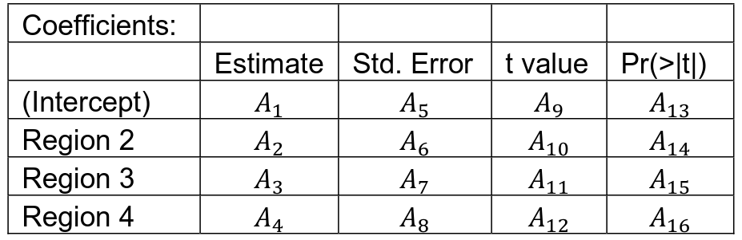
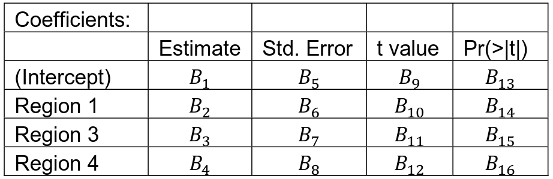
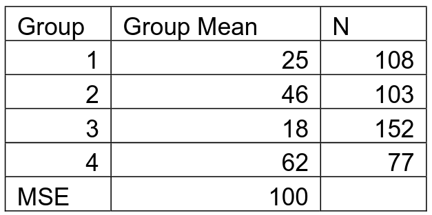
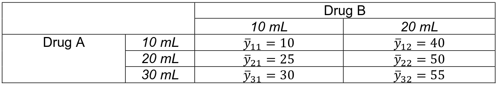
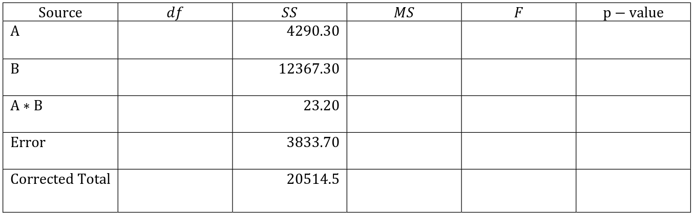

# Problem 1

Consider a model to predict the average length of a physician’s stay based on
the four regions. The one-way ANOVA model $\log_10Y \sim \text{Region}$ can be
represented with different factor effects model, depending on the baseline.
Hence, the mean responses, $\mu_1$, $\mu_2$, $\mu_3$, and $\mu_4$ are the means
computed on $\log_10Y$.

Building a model summary using the first region (1) as the baseline, the R
output shows table as the following. The values in the corresponding cells are
denoted by $A_i, \quad i = \{1, 2, ..., 16\}$.



Repeating using the second region as the baseline yields the following summary:



## 1.a

Based on Table 1, The means, $\mu_1$, $\mu_2$, $\mu_3$, and $\mu_4$ can be
represented as:

$$
\begin{aligned}
\mu_1&: A_1 + 0 = A_1 \\
\mu_2&: A_1 + A_2 \\
\mu_3&: A_1 + A_3 \\
\mu_4&: A_1 + A_4 \\
\end{aligned}
$$

## 1.b

Based on Table 2, The means, $\mu_1$, $\mu_2$, $\mu_3$, and $\mu_4$ can be
represented as:

$$
\begin{aligned}
\mu_1&: B_1 + B_2 \\
\mu_2&: B_1 + 0 = B_1 \\
\mu_3&: B_1 + B_3 \\
\mu_4&: B_1 + B_4 \\
\end{aligned}
$$

## 1.c 

To perform the hypothesis $H_0: \mu_2 = \mu_1$, the point estimate $\hat{Y}_2 -
\hat{Y}_1 = \mu_2 - \mu_1 = A_1 + A_2 - A_1 = A_2$ and the p-value is $A_{14} =
B_{14}$.

## 1.d 

To perform the hypothesis $H_0: \mu_3 = \mu_1$, the point estimate $\hat{Y}_3 -
\hat{Y}_1 = \mu_3 - \mu_1 = A_1 + A_3 - A_1 = A_3$ and the p-value is $A_{15}$.

## 1.e 

To perform the hypothesis $H_0: \mu_3 = \mu_2$, the point estimate $\hat{Y}_3 -
\hat{Y}_2 = \mu_3 - \mu_2 = B_1 + B_3 - B_1 = B_3$ and the p-value is $B_{15}$.

# Problem 2

According to the following data summary, compute the following confidence
intervals:



```{r}
df <- data.frame(
  group = c(1, 2, 3, 4), mean = c(25, 46, 18, 62), n = c(108, 103, 152, 77)
)
```

## 2.a

The difference between the average $Y$ in Groups 1 and 2 and in Groups 3 and 4, i.e.

$$
\frac{\mu_1 + \mu_2}{2} - \frac{\mu_3 + \mu_4}{2}
$$

```{r}
alpha <- 0.05
n_total <- sum(df$n)
r <- length(unique(df$group))
mse <- 100
t_crit <- qt(1 - alpha / 2, n_total - r)
l_hat <- 0.5 * (sum(df$mean[1:2]) - sum(df$mean[3:4]))
stderr <- sqrt(mse * 0.5^2 * sum(1 / df$n))
interval_lower <- l_hat - stderr * t_crit
interval_upper <- l_hat + stderr * t_crit
```

$$
L = \frac{\mu_1 + \mu_2}{2} - \frac{\mu_3 + \mu_4}{2}
$$

so $c_1 = \frac{1}{2}, c_2 = \frac{1}{2}, c_3 = -\frac{1}{2}, c_4
= - \frac{1}{2}$.

$$
\hat{L} = \frac{\bar{Y}_1 + \bar{Y}_2}{2} - \frac{\bar{Y}_3 + \bar{Y}_4}{2}
= \frac{`r df$mean[1]` + `r df$mean[2]`}{2} - \frac{`r df$mean[3]` + `r df$mean[4]`}{2} 
= `r l_hat`
$$

Using the $MSE$ and $n_i$ from the table:

$$
s^2[L] = MSE \sum_{i=1}^r \frac{c_i^2}{n_i} = 100\left(\frac{(1/2)^2}{108} +
\frac{(1/2)^2}{103} + \frac{(-1/2)^2}{152} + \frac{(-1/2)^2}{77}\right)
= `r stderr^2`
$$

so

$$
s[\hat{L}] = `r stderr`
$$

and with $df_E = n_T - r = 108 + 103 + 152 + 77 - 4 = `r n - r`$, the critical
t-value is:

$$
t(1 - \alpha / 2, n - r) = t(`r 1 - alpha / 2`, `r n - r`) = `r t_crit`
$$

Therefore, the 95% confidence interval on the difference is:

$$
\hat{L} \pm t(1 - \alpha / 2, n - r) s[\hat{L}] = `r l_hat` \pm `r t_crit` \cdot `r stderr` = (`r c(interval_lower, interval_upper)`)
$$

## 2.b

The simultaneous confidence intervals for the differences of the following:

$$
\mu_1 - \mu_2, \quad \mu_1 - \mu_3, \quad \mu_2 - \mu_3
$$

```{r}
group_names <- c("1-2", "1-3", "2-3")
g <- length(group_names)
bonf <- qt(1 - alpha / (2 * g), n_total - r)
df_bonf <- data.frame()
coeffs <- list(
  c(1, -1, 0, 0),
  c(1, 0, -1, 0),
  c(0, 1, -1, 0)
)

df_bonf[group_names, "l_hat"] <- sapply(
  coeffs,
  function(coef) sum(df$mean * coef)
)

df_bonf[group_names, "stderr"] <- sapply(
  coeffs,
  function(coef) sqrt(mse * sum(coef^2 / df$n))
)

intervals <- t(rbind(
  df_bonf$l_hat - bonf * df_bonf$stderr,
  df_bonf$l_hat + bonf * df_bonf$stderr
))
rownames(intervals) <- group_names
colnames(intervals) <- c(
  paste(100 * alpha / 2, "%"), paste(100 * (1 - alpha / 2), "%")
)
```

Calculating the critical Bonferroni value:

$$
B = t(1 - \alpha / (2g), n_T - r) = t(1 - `r alpha` / (2 \cdot `r g`), `r n` - `r r`)
= `r bonf`
$$


The $\hat{L}$ for each case are:

$$
\begin{aligned}
\bar{Y}_1 - \bar{Y}_2 &= `r df$mean[1]` - `r df$mean[2]` = `r df_bonf["1-2", "l_hat"]` \\
\bar{Y}_1 - \bar{Y}_3 &= `r df$mean[1]` - `r df$mean[3]` = `r df_bonf["1-3", "l_hat"]` \\
\bar{Y}_2 - \bar{Y}_3 &= `r df$mean[2]` - `r df$mean[3]` = `r df_bonf["2-3", "l_hat"]` \\
\end{aligned}
$$

The $s[\hat{L}]$ for each case are:

$$
\begin{aligned}
\sqrt{MSE \sum_{i = 1}^r c_i^2 / n_i} &= \sqrt{`r mse` \left(\frac{1}{`r df$n[1]`} + \frac{1}{`r df$n[2]`}\right)} = `r df_bonf["1-2", "stderr"]` \\
\sqrt{MSE \sum_{i = 1}^r c_i^2 / n_i} &= \sqrt{`r mse` \left(\frac{1}{`r df$n[1]`} + \frac{1}{`r df$n[3]`}\right)} = `r df_bonf["1-3", "stderr"]` \\
\sqrt{MSE \sum_{i = 1}^r c_i^2 / n_i} &= \sqrt{`r mse` \left(\frac{1}{`r df$n[2]`} + \frac{1}{`r df$n[3]`}\right)} = `r df_bonf["2-3", "stderr"]` \\
\end{aligned}
$$

And using the formula

$$
\hat{L} \pm Bs[\hat{L}]
$$

for each group...

$$
\begin{aligned}
`r df_bonf["1-2", "l_hat"]` &\pm `r bonf` \cdot `r df_bonf["1-2", "stderr"]` \\
`r df_bonf["1-3", "l_hat"]` &\pm `r bonf` \cdot `r df_bonf["1-3", "stderr"]` \\
`r df_bonf["2-3", "l_hat"]` &\pm `r bonf` \cdot `r df_bonf["2-3", "stderr"]` \\
\end{aligned}
$$

...the intervals are

$$
\begin{aligned}
\mu_1 - \mu_2&: (`r intervals["1-2", ]`) \\
\mu_1 - \mu_3&: (`r intervals["1-3", ]`) \\
\mu_2 - \mu_3&: (`r intervals["2-3", ]`) \\
\end{aligned}
$$

# Problem 3

Problems 3 and 4 are both based on the following scenario:

You are part of a team that is investigating the effectiveness of two different
ingredients in a drug. For the first ingredient (factor A), you test three
different amounts, 10mL, 20mL, and 30mL. For the second ingredient (factor B),
you test 2 different amounts, 10mL and 20 mL. With three levels of the first
ingredient and two levels of the second ingredient, you can create six different
formulations for the drug. You obtain a random sample of 60 individuals. For
each of the six formulations, you randomly select 10 individuals to receive that
formulation of the drug and then collect a response from each individual.

## 3.a

Write down the two-way ANOVA model that would be used for this experiment. Use
the factor-effects notation for the model, not the cell-means notation. Define
each component of the model in context of the problem. For example, don’t just
refer to factor A or factor B, but refer to drugs themselves. Also be sure to
include information about the number of levels for each factor and the number of
replicates.

The model for this experiment in factor-effects notation is:

$$
Y_{ijk} = \mu_{\cdot \cdot} + \alpha_i + \beta_j + (\alpha \beta)_{ij} +
\varepsilon_{ijk}
$$

$Y_{ijk}$ is the $k$th observation/case of the dependent variable, drug
effectiveness, for a given treatment where the first ingredient is used at the
$i$th level and the second ingredient is used at the $j$th level. 

$\mu_{\cdot \cdot}$ is the overall mean drug effectiveness across all treatments
(all $ab = 3 \cdot 2 = 6$ combinations of factor levels).

$\alpha_i, \beta_j$ are the main effects for the first and second ingredients
when they are used at the $i$th and $j$th level, respectively. These correspond
to the increase in effectiveness of the drug that we observe as a result of
adding in the first/second ingredient at a given level.

$(\alpha \beta)_{ij}$ is the interaction effect between factors when $A$ is at
the $i$th level and $B$ is at the $j$th level. It corresponds to the difference
in effectiveness of the drug that we observe from the combination of ingredients
at the given levels if the two ingredients were purely additive and the true
effectiveness of that combination.

$\varepsilon_{ijk}$ is the i.i.d. error associated with each observation/case.

There are $a = 3$ levels for the first ingredient (factor $A$) and $b = 2$
levels for the second (factor $B$). There are $n = 10$ replicates for each
of the $ab = 6$ treatments, yielding $n_T = nab = 60$ total cases.

## 3.b

Pretend the table below contains information about the sample means for each of
the six formulations of the drug. Draw an interaction plot for these data. For
these data, does there appear to be an interaction? Why or why not?



```{r fig.cap="Interaction Plot"}
library(ggplot2)

drug <- data.frame(
  "A_level" = c("A10mL", "A20mL", "A30mL"),
  "B10mL" = c(10, 25, 30),
  "B20mL" = c(40, 50, 55),
  check.names = FALSE
)

ggplot(drug, aes(x = A_level, group = 1)) +
  geom_line(aes(y = B10mL, color = "B10mL")) +
  geom_point(aes(y = B10mL)) +
  geom_line(aes(y = B20mL, color = "B20mL")) +
  geom_point(aes(y = B20mL)) +
  labs(x = "A Level", y = "Drug Effectiveness")
```

There is a slight interaction effect for the data since the lines in the
interaction plot are not perfectly parallel; the transition from 10 to 20 mL of
the first ingredient (factor $A$) yields a higher increase in drug effectiveness
when the second ingredient (factor $B$) uses 10mL than when it uses 20mL. We
would estimate that this interaction is probabily not significant since the
lines are close to parallel, but we would need more information to test this
statistically.

## 3.c

Regardless of your answer to part (b), assume that the interaction between drugs
A and B is not important and can be ignored. You are interested in comparing the
average of levels 2 (20 mL) and 3 (30 mL) of Drug A with level 1 of drug A (10
mL) to see if there is a significant difference between them. That is, you are
interested in the following contrast:

$$
L = \frac{\mu_{2 \cdot} + \mu_{3 \cdot}}{2} - \mu_{1 \cdot}
$$

### 3.c.i

What is the point estimate for this contrast, $\hat{L}$?

```{r}
a_means <- rowMeans(drug[2:3])
l_hat <- (a_means[2] + a_means[3]) / 2 - a_means[1]
```

The point estimate is:

$$
\begin{aligned}
\hat{L} &= \frac{\bar{y}_{2 \cdot} + \bar{y}_{3 \cdot}}{2} - \bar{y}_{1 \cdot} \\
& = \frac{(25 + 50)/2 + (30 + 55)/2}{2} - (10 + 40)/2 \\
& = \frac{`r (25 + 50)/2` + `r (30 + 55)/2`}{2} - `r (10 + 40)/2` \\
& = `r ((25 + 50)/2 + (30 + 55)/2) / 2` - `r (10 + 40)/2` \\
& = `r l_hat` \\
\end{aligned}
$$

### 3.c.ii

What is the confidence interval for this contrast? Is there a significant
difference? (Assume that the MSE is 60).

```{r}
mse <- 60
coef <- c(-1, 0.5, 0.5)
a <- 3
b <- 2
n <- 10
n_total <- 60
stderr <- sqrt(mse / (b * n) * sum(coef^2))
t_crit <- qt(1 - alpha / 2, (n - 1) * a * b)
interval_lower <- l_hat - t_crit * stderr
interval_upper <- l_hat + t_crit * stderr
```

We are assuming the interaction effects are negligible, so we can perform an
estimation of a linear combination of factor level means:

$$
L = \sum c_i \mu_{i \cdot}
$$

where the point estimate is $\hat{L} = `r l_hat`$ from the previous part, and
the coefficients of the linear combination are:

$$
c_{\cdot} = \{`r coef`\}
$$

and the factor level means $\mu_{i \cdot}$ are the row-wise means of the table:

$$
\mu_{i \cdot} = \{`r a_means`\}
$$

The unbiased estimate of the standard deviation of the point estimate is:

$$
s[\hat{L}] = \sqrt{\frac{MSE}{bn} \sum c_i^2} = \sqrt{\frac{`r mse`}{`r b` \cdot `r n`}
((`r coef[1]`)^2 + `r coef[2]`^2 + `r coef[3]`^2)} = `r stderr`
$$

and the critical t-value is:

$$
t(1 - \alpha / 2, (n - 1)ab) = t(1 - `r alpha / 2`, (`r n` - 1)`r a` \cdot `r b`) = `r t_crit`
$$

So the 95% confidence interval is:

$$
\hat{L} \pm t(1 - \alpha / 2, (n - 1)ab) s[\hat{L}]
= `r l_hat` \pm `r t_crit` \cdot `r stderr` = (`r interval_lower`, `r interval_upper`)
$$

# Problem 4

Below is an example of what the ANOVA table could look like for this experiment:



## 4.a

Fill in the ANOVA table.

```{r}
df <- c(a - 1, b - 1, (a - 1) * (b - 1), a * b * (n - 1), n * a * b - 1)
ss <- c(4290.3, 12367.3, 23.2, 3833.7, 20514.5)
msa <- ss[1] / (a - 1)
msb <- ss[2] / (b - 1)
msab <- ss[3] / ((a - 1) * (b - 1))
mse <- ss[4] / (a * b * (n - 1))
ms <- c(
  msa,
  msb,
  msab,
  mse,
  NA
)
f <- c(msa / mse, msb / mse, msab / mse, NA, NA)
p <- array()
for (i in 1:5) {
  p[i] <- ifelse(is.na(f[i]), NA, 1 - pf(f[i], df[i], df[4]))
}

source <- c("$A$", "$B$", "$A \\cdot B$", "Error", "Corrected Total")

df_anova <- data.frame(source, df, ss, ms, f, p)
colnames(df_anova) <- c("Source", "df", "SS", "MS", "$F$", "$p$-value")
```

Using the SS values provided as well as the previously calculated values from
[Problem 3], the components of the table can be calculated as follows:

### Degrees of Freedom

$$
\begin{aligned}
df_A &= a - 1 = `r df[1]` \\
df_B &= b - 1 = `r df[2]` \\
df_{A \cdot B} &= (a - 1)(b - 1) = `r df[3]` \\
df_{E} &= ab(n-1) = `r df[4]` \\
df_{T} &= nab-1 = `r df[5]` \\
\end{aligned}
$$

### Mean Square Values

$$
\begin{aligned}
MSA &= \frac{SSA}{df_A}= \frac{`r ss[1]`}{`r df[1]`}= `r msa` \\
MSB &= \frac{SSB}{df_B}= \frac{`r ss[2]`}{`r df[2]`}= `r msb` \\
MSAB &= \frac{SSAB}{df_{A\cdot B}} = \frac{`r ss[3]`}{`r df[3]`}= `r msab` \\
MSE &= \frac{SSE}{df_{E}}= \frac{`r ss[4]`}{`r df[4]`}= `r mse` \\
\end{aligned}
$$

### $F$-values

$$
\begin{aligned}
F^*_A &= \frac{MSA}{MSE}= \frac{`r msa`}{`r mse`}= `r f[1]` \\
F^*_B &= \frac{MSB}{MSE}= \frac{`r msb`}{`r mse`}= `r f[2]` \\
F^*_{A \cdot B} &= \frac{MSAB}{MSE}= \frac{`r msab`}{`r mse`}= `r f[3]` \\
\end{aligned}
$$


### $p$-values

$$
\begin{aligned}
p_A &= P\{ F(df_A, df_E) > F^*_A \} = 1 - `r pf(f[1], df[1], df[4])`
= `r p[1]` \\
p_B &= P\{ F(df_B, df_E) > F^*_B \} = 1 - `r pf(f[2], df[2], df[4])`
= `r p[2]` \\
p_{A \cdot B} &= P\{ F(df_{A \cdot B}, df_E) > F^*_{A \cdot B} \} = 1 - `r pf(f[3], df[3], df[4])`
= `r p[3]` \\
\end{aligned}
$$

### Completed Table

Using the calculations above, the completed table is:

```{r fig.cap="Complete ANOVA Table", echo=FALSE}
library(knitr)
kable(df_anova)
```

## 4.b

Based on the information in the ANOVA table, does the interaction appear to be
significant?


Looking at the $A \cdot B$ row in the ANOVA table, which corresponds to the
interaction effect between factors, $A$ and $B$, we observe a very low $F$-value
of $`r f[3]`$ and a correspondingly high $p$-value of $`r p[3]`$, which means
that the chances of observing an $F$-value this low by chance around 85%, so we
would fail to reject the null hypothesis that the interaction effect is zero,
and we conclude that **the interaction does not appear to be significant**.
